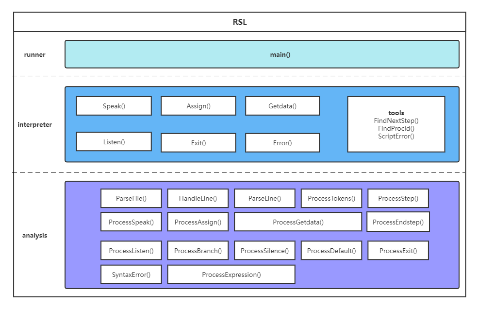

# 开发文档

## 风格

### 命名风格

- 类名统一使用首字母大写命名，如：Parser, Interperter
- 类的公开接口统一使用大驼峰命名法，如：ParserFile，ProcessStep
- 变量命名统一使用小写，如：steptree，node

### 注释风格

应为编写的公开接口编写注释

```cpp
/*作用:去除字符串中的行首空白字符
* 参数:line:待处理字符串
* 返回:无*/
void Parser::HandleLine(std::string &line)
{
   int size = line.size();
   for (int i = 0; i < size; size--)
   {
        if(line[i] == ' ')
            line.erase(i, 1);
        else
            break;
   }
}
```

### 文件目录组织

- 程序实现文件和程序放在主目录下
- .cpp源文件保存在`src` 文件夹下
- .h源文件保存在`include` 文件夹下
- .db数据库文件保存在`data` 文件夹下
- 编写的脚本.ss文件保存在`script` 文件夹下
- 测试文件和测试说明文档保存在`testbat` 文件夹下
- vscode配置.json文件保存在`.vscode` 文件夹下

## 设计与实现

### 数据结构

#### 脚本语法树

脚本语法树节点由二元组组成，第一个元素是一个`string`类型变量，第二个元素是`vector<string>` 变量，保存第一个元素的子节点

```cpp
typedef std::pair<std::string, std::vector<std::string>> stepnode;
```

[searchphone.ss](./script/searchphone.ss) 的语法树结构如下

``` ss
(Step,[(welcome)])
	(Speak,[("Hello,welcome),(use),(114")])
	(Speak,[("Please),(input),(name,),(and),(i),(will),(search),(his),(phone),				(num),(for),(you")])
	(Speak,[("If),(phone),(num),(is),(-1,),(that),(represent),(can't),(get),				(his),(phone),(num")])
	(Assign,[($name)])
	(Getdata,[($name),($phonenum)])
	(Speak,[("),($name),('s),(phone),(num),(is),($phonenum),(")])
(Endstep,)
```

### 模块划分

程序分为四个模块：

- `analysis` :提供脚本语法解析功能
- `interpreter`:提供解释脚本语法树功能
- `tools` :提供解释器执行时需要的一些小工具的功能
- `runner` :提供解释器的运行环境



## 接口

### 主要调用接口说明

如上RSL架构图所示

- analysis模块为interpreter模块提供解析脚本文件生成语法树的功能的接口，通过`ParseFile()` 实现

  ```cpp
  /*作用:读取脚本文件,生成脚本语法树
  * 参数:filename:文件名称
  * 返回:语法脚本树构建成功或失败*/
  bool Parser::ParseFile(std::string filename);
  
  /*作用:去除字符串中的行首空白字符
  * 参数:line:待处理字符串
  * 返回:无*/
  void Parser::HandleLine(std::string &line);
  
  /*作用:获得字符串中单词
  * 参数:line:待处理字符串
  * 返回:无*/
  void Parser::ParseLine(std::string line, std::vector<std::string> &token);
  
  /*作用:对单词集合进行处理,生成语法树节点
  * 参数:token:从一串字符串处理得到的单词集合
  * 返回:语法正确或错误*/
  bool Parser::ProcessTokens(std::vector<std::string> &token);
  ```

- interpreter模块为runner提供解释RSL内置命令的接口

  ```cpp
  /*作用:对关键词Speak进行解释,输出语句
   * 参数:expression:将要输出的语句
   * 返回:无*/
  void Interpreter::Speak(std::vector<std::string> expression);
  
  /*作用:对关键词Assign进行解释,对变量进行赋值
   * 参数:var:将要赋值的变量集合
   * 返回:无*/
  void Interpreter::Assign(std::vector<std::string> var);
  
  /*作用:对关键词Getdata进行解释,对db数据库字典查找数据
   * 参数:parameter:parameter中有两个字符串,字符串1为key变量,字符串2为将要保存value的变量
   * 返回:无*/
  void Interpreter::Getdata(std::vector<std::string> parameter);
  
  /*作用:对关键词Getdata进行解释,对db数据库字典查找数据
   * 参数:filename:传入的数据库文件路径
          parameter:parameter中有两个字符串,字符串1为key变量,字符串2为将要保存value的变量
   * 返回:无*/
  void Interpreter::Getdata(std::string filename, std::vector<std::string> parameter);
  
  /*作用:对关键词Listen进行解释,将index改为用户输入的指令对应的Step步骤
  * 参数:timer:时间段
         index:当前runner环境中运行到的step步骤索引
  * 返回:无*/
  void Interpreter::Listen(std::vector<std::string> timer, int &index);
  
  /*作用:对关键词Exit进行解释,退出程序
   * 参数:expression:将要输出的语句
   * 返回:无*/
  void Interpreter::Exit();
  
  /*作用:错误处理
   * 参数:无
   * 返回:无*/
  void Interpreter::Error();
  ```

- tools模块为interpreter提供所需要的工具组件接口

  ```cpp
  /*作用:查找下一个Step,将index改到下一个Step步骤
  * 参数:instruction:指令名称
         index:当前Step索引
  * 返回:无*/
  void FindNextStep(std::string instruction, int &index);
  ```

## 测试

### 测试桩

通过编写[anatest.cpp](./testbat/anatest.cpp) 对anatest模块进行测试

### 自动测试脚本

使用了bat批处理进行自动化测试

通过编写[testana.bat](./testbat/testana.bat) 对anatest模块进行自动化测试

通过编写[testss.bat](./testbat/testss.bat) 对整个RSL程序进行自动化测试

### 详细测试说明

查看[测试文档说明](./testbat/readme.md)

## 记法

### 脚本内置命令

- Step  [stepname]:

- Speak  [sentense]:在终端输出sentense

- Listen  [starttime  stoptime]:在startime到stoptime时间内等待用户的输入，并且转到相应的操作

  - Branch  [instruction]  [processname]:用于Listen的分支语句结构，instruction为指令名称，当用户输入正确的指令后，会转入processname的Step中
  - Silence  [processname]:用于Listen的分支语句结构，当用户沉默时，转入processname的Step中
  - Default  [processname]:用于Listen的分支语句结构，当用户未执行上述两种操作，其余情况的默认处理，转入processname的Step中

  > 注意：请在使用Listen语句时，保证Default默认处理流程，即在每个Listen语句的分句下面，使用Default  [processname]

- Assign  [var1]  [var2]  [var3]  ......:变量赋值语句，将用户输入赋值给var1，var2，var3

- Getdata  [keyvar]  [savevar]:数据库db文件查找语句，keyvar为键变量，通过keyvar中的值查找数据库中的匹配项，如果查找到将其保存在savevar变量中，未查找到会在savevar中保存-1

- Exit：用于Step语句块中退出，如果语句块中使用了该语句，则此Step块执行到Exit会退出程序

- Endstep:用于Step语句块中循环，使用Endstep后，程序会一直循环执行此Step。

  > 注意：编写的脚本中Step中必须使用Listen或Exit或Endstep保证程序正常运行

### 注释

以‘#’开头为注释

> #我是一行注释

### 变量

以'$'开头为变量

> $var

